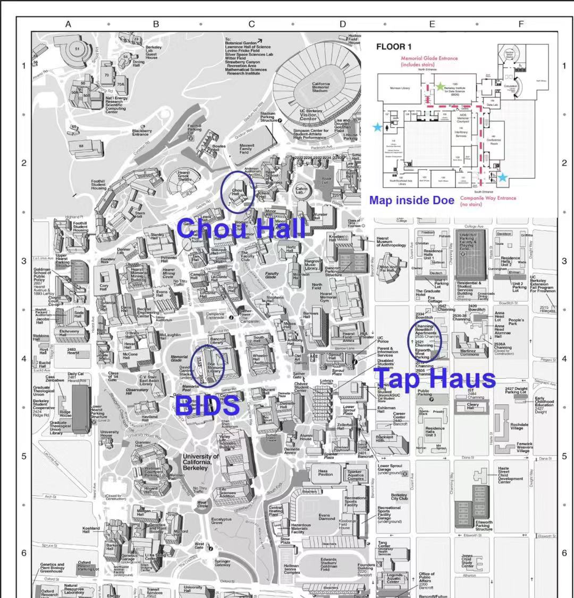
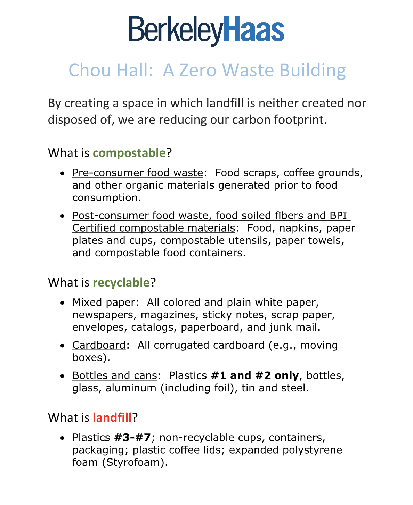

### Agenda

<a href="https://www.textxd.org/2019/program/" class=".btn-inverse" style="text-size: 200%"> TextXD 2019 Program Agenda</a>

### When and Where?
| Day | Date | Focus | Location |
|:-------|:------|:---------|:---|
| Day 1 | Tuesday, Dec. 3</a> | Training workshops | Spieker Forum at Chou Hall |
| Day 2 | Wednesday, Dec. 4</a> | Talks and posters | Spieker Forum at Chou Hall |
| Day 3 | Thursday, Dec. 5</a> | Talks and posters |  Spieker Forum a Chou Hall |
| Day 4 | Friday, Dec. 6</a> | Collaboration and coding | BIDS (190 Doe) |

Reception: 5:30 pm on Dec. 5 @ Tap Haus

### Campus Map

**[Interactive Directions to Spieker Forum at Chou Hall](https://homecoming.berkeley.edu/location/spieker-forum-chou-hall-haas-school)**

**[Interactive Directions to BIDS(190 Doe)](https://bids.berkeley.edu/about/directions-and-travel)**

**[Interactive Directions to Tap Haus](https://www.google.com/maps/place/The+Tap+Haus/@37.8676762,-122.2603303,17z/data=!3m1!4b1!4m5!3m4!1s0x80857c2f166365c5:0x15898b0888927c2f!8m2!3d37.867672!4d-122.2581416)**

### Parking

**Public parking lots near the Berkeley campus allowing all-day parking**

Note that visitor parking around the Berkeley campus is very limited, and most street parking is only 2 hours.  We recommend taking public transportation if you can, otherwise please research the options below in advance and leave extra time.

* Telegraph Channing Garage
  * 2450 Durant Avenue, Berkeley (between Dana St and Telegraph Ave)
  * 510-843-1788
* Douglas Parking LLC - B7 Garage
  * 2304 Bowditch Street, Berkeley (between Bancroft Way & Durant St)
  * 510-548-2357
* Oxford Garage
  * 2165 Kittredge St, Berkeley (between Shattuck Ave & Fulton St)
  * Berkeley, CA 94704
  * 510-843-1788

### Zero Waste Policy

